# 🚕 NYC Taxi: From ETL to Power BI
### End-to-End Business Intelligence Solution using SSIS, SSAS Tabular & Power BI


---

## 📌 Project Overview

This project delivers a **full-stack Business Intelligence solution** built on the official **NYC Yellow Taxi Trip Dataset (June 2020)**. It covers the complete data lifecycle — from raw CSV extraction, through a layered ETL pipeline, to a semantic analytical model, and finally an interactive Power BI reporting layer.

The goal is to transform ~550,000 raw trip records into actionable insights on **demand patterns, revenue behavior, payment trends, and geographic performance** for the NYC Taxi & Limousine Commission.

---

## 🎯 Business / Analytical Questions

1. What are the peak periods with the highest demand?
2. At what times of day and days of the week is taxi demand at its peak?
3. Is the distribution of demand between morning and evening time periods well-balanced?
4. What is the preferred payment method for customers, and does it directly impact revenue and tip volumes?
5. How does weekend demand compare with weekday demand?
6. What is the average tip percentage across different vendors and payment types?
7. Which boroughs hold the longest average trip durations, indicating high transit times?
8. How does each payment method contribute sequentially to the total financial bottom line?

---

## 🛠️ Tech Stack

| Layer | Tool |
|---|---|
| ETL (Extract, Transform, Load) | SQL Server Integration Services (SSIS) |
| Semantic / Analytical Model | SQL Server Analysis Services (SSAS) Tabular + DAX |
| Data Warehouse | SQL Server (Star Schema) |
| Reporting & Visualization | Power BI |
| Modeling Tool | Oracle Data Modeler (Conceptual/Logical/Physical) |

---

## 🗂️ Data Source

- **Dataset:** Official NYC Yellow Taxi Trip Data — June 2020
- **Format:** CSV (Trip records + Taxi Zone Lookup table)
- **Key attributes:** Pickup/dropoff timestamps, trip distance, passenger count, pickup/dropoff zones, rate code, payment type, and a full financial breakdown (fare, tips, tolls, surcharges, total amount)

### Data Quality Handling
- ✅ **Negative values corrected** across `fare_amount`, `extra`, `mta_tax`, `improvement_surcharge`, and `total_amount`
- ✅ **Zero-distance trips resolved** — filtered out logical inconsistencies (0 miles with active timestamps)
- ✅ **Missing/invalid identifiers fixed** — resolved NULLs and placeholder codes (e.g., `99`) in `passenger_count`, `RatecodeID`, and `store_and_fwd_flag`
- ✅ **Feature engineering** — derived `duration_min` (trip duration in minutes) from pickup/dropoff timestamps

---

## 🏗️ Data Modeling — Star Schema

The warehouse follows a classic **star schema** with one central fact table and six dimensions.

**Fact Table**
- `FactTrips` — passenger count, trip distance, fare amount, extra, MTA tax, tip amount, tolls, surcharges, total amount, trip duration, store & forward flag

**Dimensions**
- `DimVendor` — trip technology provider
- `DimRateCode` — standard, JFK, Newark, negotiated fare, etc.
- `DimPaymentType` — credit card, cash, no charge, dispute, etc.
- `DimLocation` *(role-playing: Pickup & Dropoff)* — Borough, Zone, Service Zone
- `DimDate` *(role-playing: Pickup & Dropoff)* — full calendar attributes incl. `IsWeekend`
- `DimTime` — hour, hour label, time period (Morning/Afternoon/Evening/Night)

> **Role-Playing Dimensions:** `DimLocation` and `DimDate` are each linked twice to `FactTrips` (once for Pickup, once for Dropoff). Only one relationship is kept **Active**; the second is **Inactive** and dynamically activated at query time using the `USERELATIONSHIP` DAX function inside Dropoff-specific measures.

---

## 🔄 ETL Pipeline (SSIS)

Three layered databases orchestrate the pipeline:

| Layer | Purpose |
|---|---|
| `ODS_NYCTaxi` | Raw operational data store |
| `STG_NYCTaxi` | Cleaned & conformed staging layer |
| `DWH_NYCTaxi` | Final dimensional warehouse |

**A. ODS Package** — Loads raw Yellow Taxi CSV (549,760 rows) and Zone Lookup CSV (265 rows) directly into the operational store.

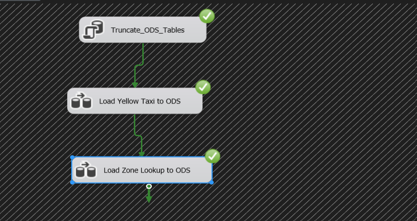

**B. STG Package** — Applies business rules and cleaning logic:
- Calculates trip duration, handles negative financial values, resolves invalid placeholder codes
- Conditional Split separates valid trips from invalid ones
- **Result:** 528,441 valid rows → `STG_YellowTaxi` | 21,319 invalid rows → `STG_InvalidTrips`

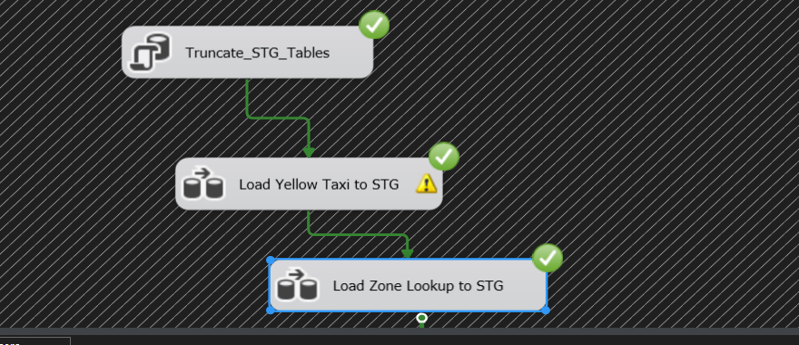

**C. DWH Package** — Loads dimensions first (static + `DimLocation`), then loads `FactTrips` using Lookup transformations to resolve foreign keys (`VendorKey`, `RateCodeKey`, `PaymentTypeKey`, `LocationKey` for both Pickup and Dropoff) against the dimension tables.

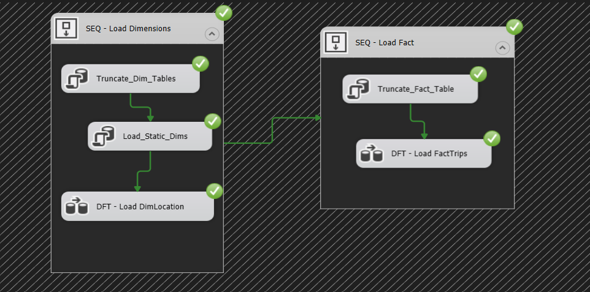

---

## 📈 Semantic Model (SSAS Tabular)

Built using **SSAS Tabular Model** with the **xVelocity in-memory engine** for fast analytical queries. Relationships between `FactTrips` and all six dimensions were defined to form a fully connected star schema, with a custom **DAX measure library** covering:

- Total Trips, Total Revenue, Avg Fare per Trip, Avg Trip Distance
- Weekend vs Weekday Trips, % Weekend Trips
- Tip Percentage, % Trips With Tip, Avg Tip When Tipped
- Revenue by Borough, Avg Trip Duration by Borough, Avg Speed (mph)
- Trips by Dropoff Zone, Revenue by Dropoff Borough (using `USERELATIONSHIP`)

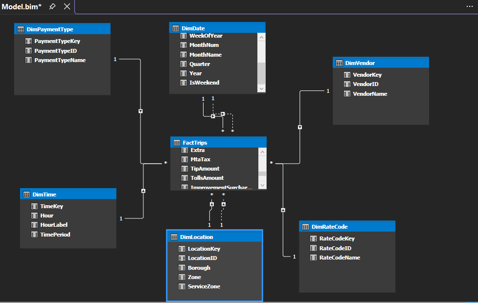

---

## 📊 Power BI Dashboard

A 4-page interactive report connects directly to the Data Warehouse, featuring a filter panel, drill-through pages, and an **Insights Toggle** button for quick business summaries.

### Page 1 — Executive Overview
KPIs: **528K Total Trips**, **$9.92M Total Revenue**, **$13.50 Avg Fare/Trip**, **4.25 mi Avg Trip Distance**. Includes trips by vendor, payment type breakdown, and a daily trips/revenue trend for June 2020.

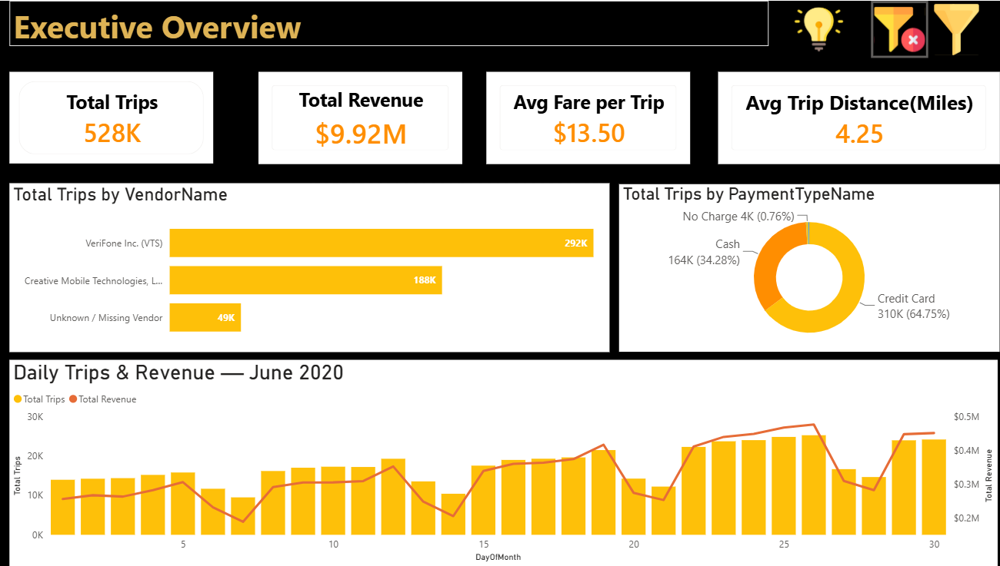

**Filter Panel** — Users can filter the entire view by any date or dimension to see localized performance.

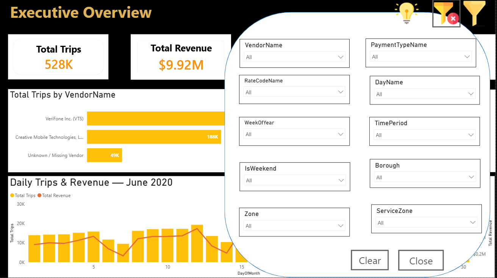

**Insights Toggle** — Clicking the lightbulb icon triggers a pop-up with a quick, auto-generated business summary of the page.

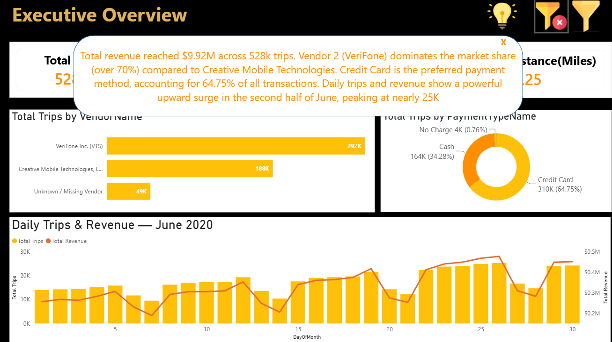

**Drill-through: Vendor Performance Deep-Dive** — Right-clicking any vendor unlocks an operational efficiency dashboard tracking Revenue per Mile, Tip Percentages, and Preferred Payment Methods.

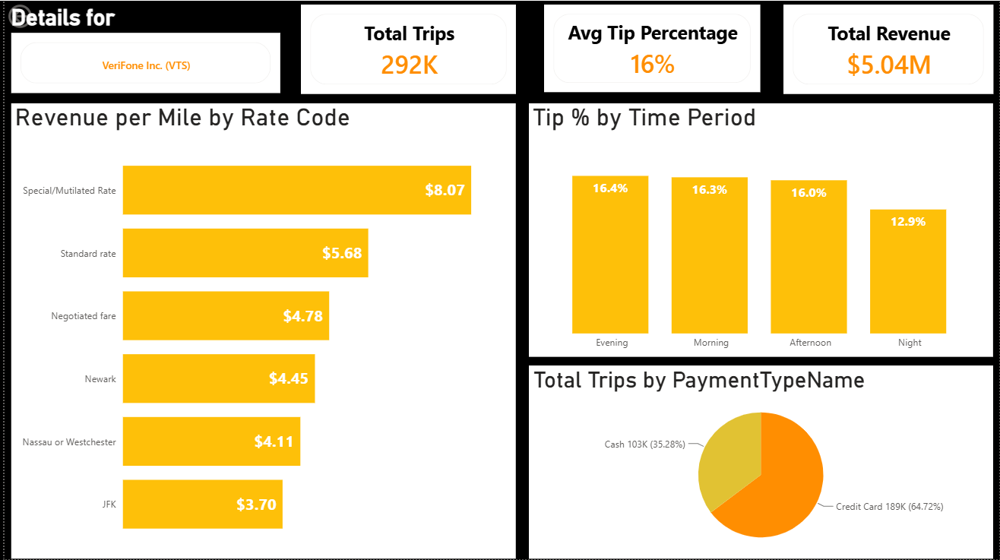

### Page 2 — Time & Demand Patterns
Weekend vs. Weekday trip volume (103K vs. 426K, **19.5% weekend share**), trips by time period, a day-of-week demand curve, and an hour × day heatmap of trip volume.

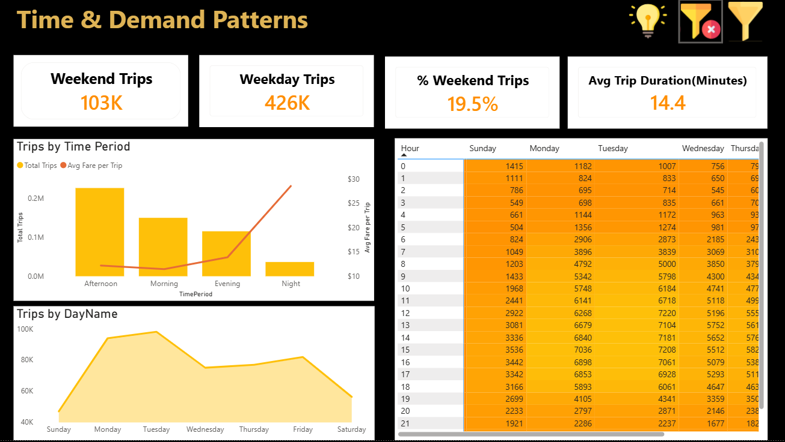

### Page 3 — Revenue & Pricing Deep Dive
Revenue per Mile by Rate Code, Tip % by Vendor, Tips Analysis by Payment Type, and Total Amount breakdown by payment method.

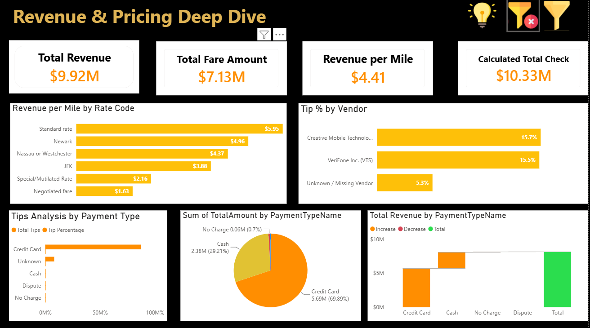

### Page 4 — Geography
Tree-map of trip distribution across NYC boroughs, average trip duration by borough, and Top 5 pickup zones.

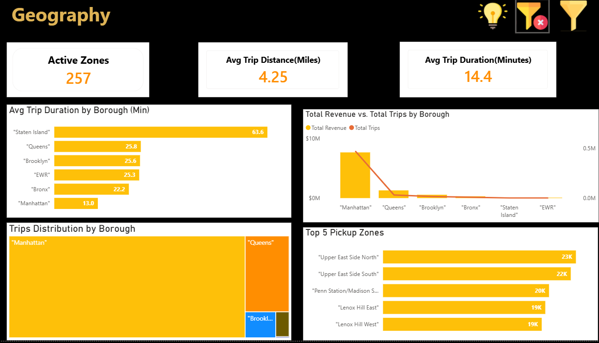

**Drill-through: Borough → Zone** — Clicking into a borough (e.g., Manhattan) reveals Avg Trip Duration (13.0 min), Avg Fare per Trip ($11.18), Avg Trip Distance (3.28 mi), and a full zone-level breakdown.

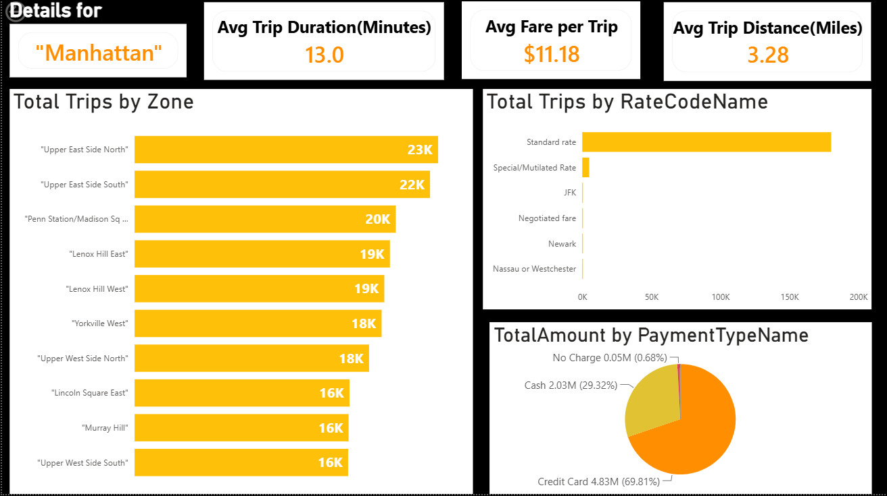

---

## 🔑 Key Insights

- **VeriFone dominates** the vendor market with over 70% share compared to Creative Mobile Technologies.
- **Credit card is the preferred payment method**, accounting for **64.75%** of all transactions.
- Daily trips and revenue show a **strong upward trend in the second half of June**, peaking near 25K trips/day.
- Weekend trips make up only **19.5%** of total volume — weekday demand clearly dominates.
- **Manhattan** has the shortest average trip duration (13.0 min) despite being the busiest borough, while **Staten Island** has the longest (63.6 min).
- Tip percentages are highest during **Evening (16.4%)** and lowest at **Night (12.9%)**.

---

## 📁 Repository Structure

```
nyc-taxi-etl-ssis-ssas-powerbi/
│
├── README.md
├── docs/
│   └── NYC_Taxi_Technical_Documentation.pdf
└── screenshots/
    ├── ssis_ods_package.png
    ├── ssis_stg_package.png
    ├── ssis_dwh_package.png
    ├── ssas_model_diagram.png
    ├── dashboard_executive_overview.png
    ├── dashboard_filter_panel.png
    ├── dashboard_insights_toggle.png
    ├── dashboard_vendor_drillthrough.png
    ├── dashboard_time_demand.png
    ├── dashboard_revenue_pricing.png
    ├── dashboard_geography.png
    └── dashboard_geography_drillthrough.png
```

---

## 👩‍💻 Author

**Safaa Mahmoud**
Data Analytics Trainee | Aspiring Data Engineer
